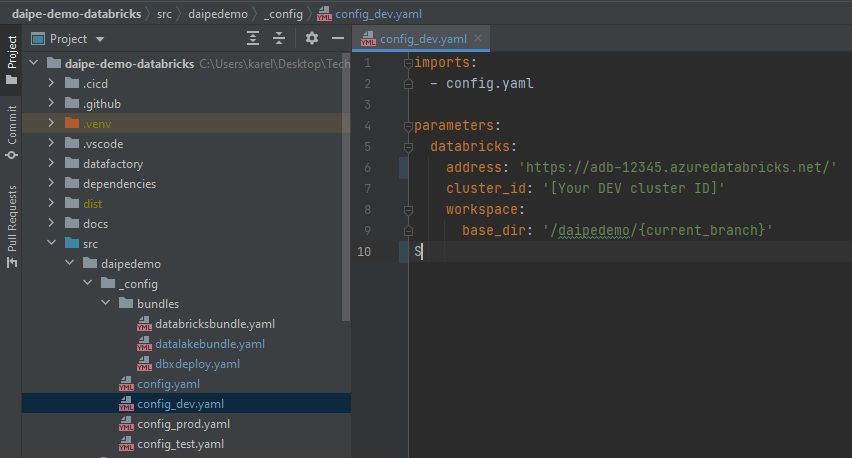
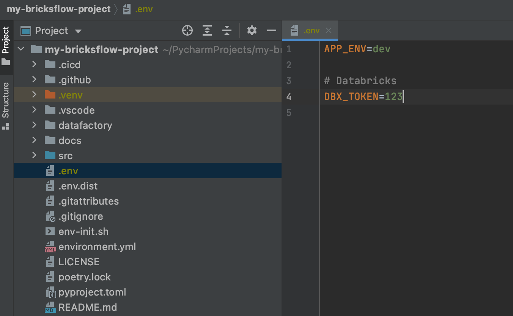

# Daipe demo project

## Prerequisites

The following software needs to be installed first:

  - [Miniconda package manager](https://docs.conda.io/en/latest/miniconda.html)
  - [Git for Windows](https://git-scm.com/download/win) or standard Git in Linux (_apt-get install git_)
  
We recommend using the following IDEs:

  - [PyCharm Community or Pro](https://www.jetbrains.com/pycharm/download/) with the [EnvFile plugin](https://plugins.jetbrains.com/plugin/7861-envfile) installed
  - [Visual Studio Code](https://code.visualstudio.com/download) with the [PYTHONPATH setter extension](https://marketplace.visualstudio.com/items?itemName=datasentics.pythonpath-setter) installed

## Cloning Daipe demo project

* On **Windows**, use Git Bash
* On **Linux/Mac**, the use standard terminal

**Clone Daipe demo repository**

```
git clone https://github.com/daipe-ai/daipe-demo-databricks.git
```

**Configure the local project**

In `src/daipedemo/_config/config_dev.yaml` fill Databricks URL.



Create `.env` file from `.env.dist` and fill Databricks Personal Access Token.



**Initialize local environment**

Now run `./env-init.sh` which will initialize your local environment.

**Activate the environment**

Now activate the Conda environment for your new project

```bash
$ conda activate $PWD/.venv
```

or use a shortcut

```bash
$ ca
```

Now you can push your project to Databricks Workspace using following command

```bash
$ console dbx:deploy --env=dev
```

And you should see the pushed project in Databricks workspace


**Important scripts:**

1. ```poe flake8``` - checks coding standards
1. ```poe container-check``` - check app container consistency (if configured properly)
