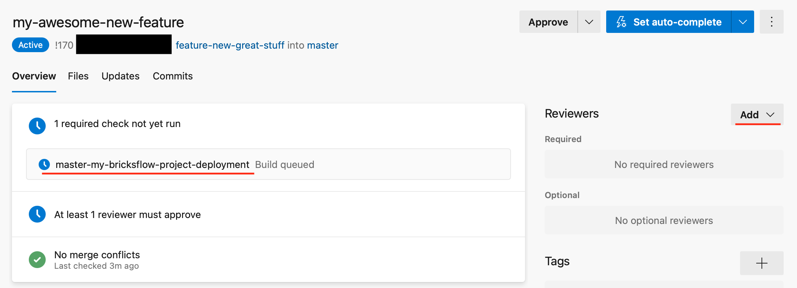

# Create a new feature 

## Creating new feature in Databricks

**Cloning the master branch/folder**

- Open the Dev Databricks Workspace associated with your project.
- Under the Workspace, find the folder that has the name of your project.
- When you open it, you can see the branches active under your project.
- Clone the master folder and make your branch folder out of it.

By cloning the master you will have the most updated version of the code on your branch folder.

{: style="width: 600px; padding-left: 5%"}

**Name it** `feature-<your-branch-name>`.

{: style="width: 600px; padding-left: 5%"}

Then you can start working on the awesome new feature in your separate branch.

{: style="width: 600px; padding-left: 5%"}

When you're done with coding, you can contact Data Engineer to commit the changes for you.

Or if you are more advanced, you can go to [(Advanced) Local project setup](setup-local-project.md) and commit the changes by yourself.

## Developing DataFactory pipelines 

## Creating Pull Request

When you're done with all the changes create a Pull Request.

When the Pull Request is created the CICD pipeline is automatically triggered and the Databricks notebooks and associated DataFactory Pipelines are deployed to the TEST environment.

There will be newly created DataFactory instance based on the name of the feature branch, there you can run the tests or wait for the automatic schedule.

After the successful run of the tests add the Reviewer to the Pull Request.

When it's approved it could be merged by Squash commit to the master and the new awesome feature is automatically deployed to the DEV and with approval to the PROD environments.