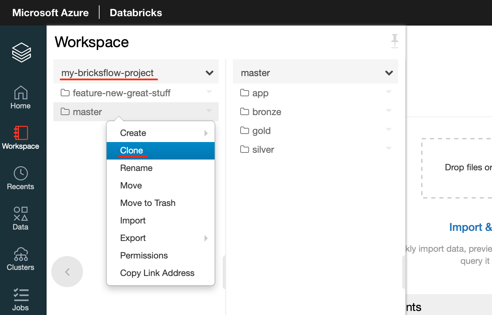
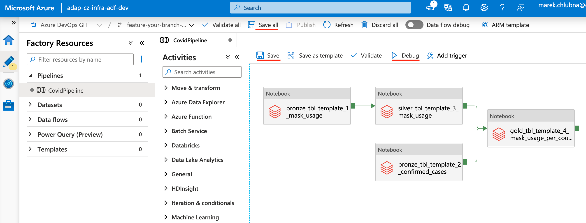

# Create a new feature 

## Creating new feature in Databricks

**Cloning the master branch/folder**

- Open the Dev Databricks Workspace associated with your project
- Under the Workspace, find the folder that has the name of your project
- When you open it, you can see the branches active under your project
- Clone the master folder and make your branch folder out of it

By cloning the master you will have the most updated version of the code on your branch folder.

{: style="width: 600px; padding-left: 5%"}

**Name it** `feature-<your-branch-name>`.

{: style="width: 600px; padding-left: 5%"}

Then you can start working on the awesome new feature in your separate branch.

{: style="width: 600px; padding-left: 5%"}

When you're done with coding, you can contact Data Engineer to commit the changes for you.

Or if you are more advanced, you can go to [(Advanced) Local project setup](setup-local-project.md) and commit the changes by yourself.

## Developing Data Factory pipelines 

Go to the Data Factory associated with your project.

- You can find it under the Dev Resource Group 
- Or you can open the link to the instance in DevOps Pipelines - Deploy Data Factory to dev environment (see picture below).

In Data Factory go to the Author section.

{: style="width: 700px; padding-left: 5%"}

**Create or Select existing branch:**

- If you are creating pipeline for the notebooks in the master branch select **Create new** and name it
- If you want to create pipeline based on the notebooks from the commited feature branch select **Use existing** and select the branch

{: style="width: 600px; padding-left: 5%"}

On top you can see that you are using your branch.

You can create a new pipeline or update the existing one by selecting it under the Pipelines. 

We are going to update the existing one `CovidPipeline` for our demo purpose. 

When you're done with editing the pipeline:

- Debug it
- After successful run hit Save (or Save All for multiple pipelines)

The new commit in DevOps repository under your branch used in Data Factory will be created. 

## Creating Pull Request

When you're done with all the changes create a Pull Request.

When the Pull Request is created the CICD pipeline is automatically triggered and the Databricks notebooks and associated DataFactory Pipelines are deployed to the TEST environment.

There will be newly created DataFactory instance based on the name of the feature branch, you can find the link in the DevOps Pipelines - Deploy Data Factory to test environment.

**To run tests:** 

- Open the TEST Data Factory
- Go to Author Section
- Select the pipeline you are merging and hit Debug

After the successful run of the tests add the Reviewer to the Pull Request and provide him with the test results.

When it's approved it could be merged by Squash commit to the master and the new awesome feature is automatically deployed to the DEV and with approval to the PROD environments.
