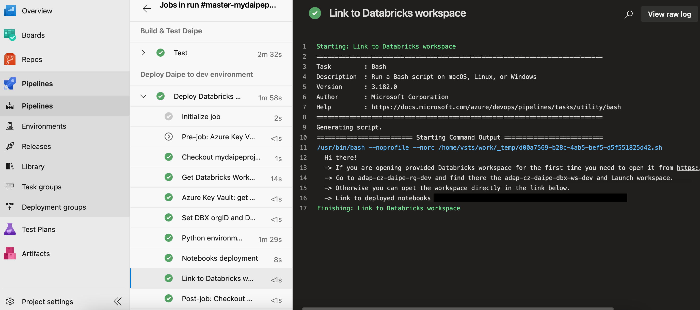

# Setting up local development environment

## Prerequisites

The following software needs to be installed first:

  - [Miniconda package manager](https://docs.conda.io/en/latest/miniconda.html)
  - [Git for Windows](https://git-scm.com/download/win) or standard Git in Linux (_apt-get install git_)
  
We recommend using the following IDEs:

  - [PyCharm Community or Pro](https://www.jetbrains.com/pycharm/download/) with the [EnvFile plugin](https://plugins.jetbrains.com/plugin/7861-envfile) installed
  - [Visual Studio Code](https://code.visualstudio.com/download) with the [PYTHONPATH setter extension](https://marketplace.visualstudio.com/items?itemName=datasentics.pythonpath-setter) installed

## Configure the project and environment

Firstly you need to clone the git repository that holds the Daipe based project. 


Then open the folder in terminal and run `./env-init.sh`.

{: style="width: 500px;"} 

The whole virtual environment with project dependencies will be created and ready to use.

**Getting Databricks token:**

Open the DEV Databricks workspace. 

(You can find the link to the corresponding Databricks workspace directly in the CICD pipeline - Deploy Daipe to dev environment section.) 



Generate new token under the User Settings. See picture below for navigation.


Copy the Value of the Token.

Open the cloned project in your favorite IDE and paste your Databricks token to the `[PROJECT_ROOT]/.env` file.


The whole project is set up. 

For activating the environment use:
```bash
$ conda activate $PWD/.venv
```

or use a shortcut

```bash
$ ca
```

## Syncing local project with Databricks 

Create a feature branch and then with activated conda environment use the console command:

```bash
$ console dbx:deploy --env=dev
```

Your feature branch will be deployed to the DEV DataBricks workspace.


You can now code some awesome new features!

When you're happy with what you've done, open the project folder in terminal and use the console command:

```bash
$ console dbx:workspace:export --env=dev
```
Then you just need to commit the changes and push the feature branch to the DevOps project. 

**Same with existing feature branch folder in Databricks.**

If you are Data Engineer and Data Scientist provided the Databricks folder for you:

- Create a feature branch on local with the same name as the folder in databricks. 
- Use dbx:workspace:export to sync the notebooks to the local
- commit the changes and push them to the DevOps

