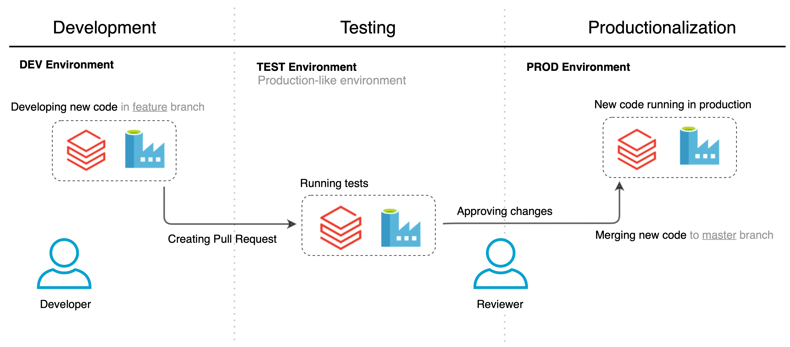

# Data Lake project workflow

## Introduction 

Our Workflow contains three environments: DEV, TEST, PROD.

Environments correspond to the separate resource groups.

In the current setup the DEV and TEST are located under one Subscription and PROD lies on different one.

!

As you can see on the diagram above, the workflow contains protected master branch, which is auto-deployed to the DEV and (with approval) to PROD environment after every merge.

The feature branches can be merge to the master by approved Pull Requests:

- When the Pull Request is made, the feature branch is automatically deployed to the TEST environment and the tests are run
- After successfully run tests, the dedicated person can approve the Pull Request and it can be merged
- Merging is done by Squash commit

## Prerequisites

The following software needs to be installed first:

  - [Miniconda package manager](https://docs.conda.io/en/latest/miniconda.html)
  - [Git for Windows](https://git-scm.com/download/win) or standard Git in Linux (_apt-get install git_)
  
We recommend using the following IDEs:

  - [PyCharm Community or Pro](https://www.jetbrains.com/pycharm/download/) with the [EnvFile plugin](https://plugins.jetbrains.com/plugin/7861-envfile) installed
  - [Visual Studio Code](https://code.visualstudio.com/download) with the [PYTHONPATH setter extension](https://marketplace.visualstudio.com/items?itemName=datasentics.pythonpath-setter) installed

## Creating feature branch

Firstly you need to clone the git repository that holds the Bricksflow based project. 
!

Then open the folder in terminal and run ./env-init.sh.
!
