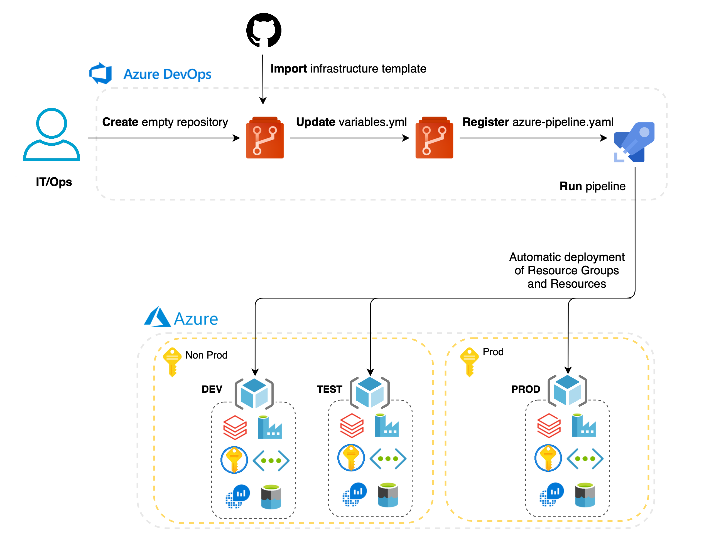
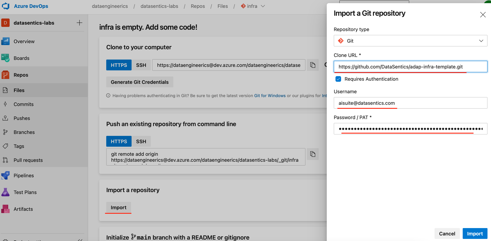

# Spinning up Data Lake resources

[Go to setup steps ↓](datalake-resources-setup.md#1-create-repository-for-infrastructure-and-import-its-code)

{: style="width: 700px; padding-left: 5%"}

**Overview of project workflow (environments / branches):**

| Environment 	| Branch  	| Databricks Workspace 	| Databricks Code branch                     	| DataFactory Resource                         	| DataFactory Pipelines Code branch          	| APP_ENV                                       	|
|-------------	|---------	|----------------------	|--------------------------------------------	|----------------------------------------------	|--------------------------------------------	|-----------------------------------------------	|
| tmp         	| tmp     	| DBX tmp              	| -                                          	| -                                            	| -                                          	| -                                             	|
| sandbox     	| sandbox 	| DBX sandbox          	| [feature branch] (optional)                	| -                                            	| -                                          	| dev (if Bricskflow coding standards are used) 	|
| dev         	| dev     	| DBX dev              	| [feature branch] (required)                	| ADF dev                                      	| [feature branch]                           	| dev                                           	|
| test        	| test    	| DBX test             	| [feature branch] (auto-deployment with PR) 	| ADF [feature-branch] (auto-creation with PR) 	| [feature branch] (auto-deployment with PR) 	| dev                                           	|
| prod        	| master    | DBX prod              | master (auto-deployment after tag) 	        | ADF prod                                     	| master                                       	| prod                                          	|

Infrastructure repository workflow:

  - branch based deployment
  - each branch represents different environment with environment specific variables
  - master branch holds the truth and deploys prod environment resources

Daipe project repository workflow:

  - feature branches are deployed to dev environment
  - pull requests to master branch are deployed to test environment
  - the master branch is presented in dev environment and released to prod environment after tagging the release  

## 1. Create repository for infrastructure and import it's code

- In Azure DevOps click on repositories
- Click on dropdown menu
- Click on New repository

- Name it e.g. `infra`
- Uncheck Add a README
- Click Create

- Click on Import
- In Clone URL fill `https://github.com/DataSentics/adap-infra-template.git`
- In Username fill **aisuite@datasentics.com**
- In Password fill the password we have provided you with   
  (In case you don't have the password send a message to **marek.chlubna@datasentics.com**)
- Click on Import

## 2. Set main infrastructure variables

The file `.cicd/variables/variables.yml` holds the main variables that you can use to customize your infrastructure.  
The files `.cicd/variables/variables-{temp/sand/dev/test/prod}.yml` hold specific variables for each environment.

**Replace** the general placeholders in `.cicd/variables/variables.yml`:

- TENANT_ID - from [Azure setup](azure-setup.md) section 5
- PROJECT_NAME - !! should be simple lowercase name (max 5 characters) !!
- GIT_ACCOUNT_NAME - name of your devops organization
- GIT_PROJECT_NAME - name of your devops project

## 3. Create environment based branches
**Create branches** based on environments you want to deploy:  
(this needs to be done for all the environments you're about to deploy)  
For updating environment specific variables create branch and name it after the environment you want to deploy, update environment specific variables.

<u>**Non prod** environment:</u>  

- checkout newly created branch   
- in the file`.cicd/variables/variables.yml` update SERVICE_CONNECTION_NAME variable for the environment you're about to deploy
- update environment specific variables in the file `.cicd/variables/variables-{environment}.yml`
    - update desired environment variables here
    - change ADMIN_OBJECT_ID to object id of user of your choice. This user will have admin access to created keyvault
    - You can find user object id in Active Directory.

{: style="width: 900px; padding-left: 10%"}

After the successful deployment based on next steps merge the commits to the master branch!

<u>**Prod** environment:</u>    
Prod environment is based on the master branch.  
When you're about to deploy prod resources, updated the prod based variables through the pull request, optional directly in the master branch.

## 3. Create DevOps pipeline for infrastructure build & deployment

- In Azure DevOps click on pipelines
- Click on New pipeline

- Select Azure Repos Git

- Select infra repository

- It will automaticaly locate file `azure-pipelines.yml`
- Click on Save 

  
- Click on run and select created branch with the variables of the environment you'd like to deploy.

{: style="width: 600px; padding-left: 5%"}

The environment resource group based on selected branch is deployed to the Subscription.

**Run the pipeline again** with different branch selected if you'd like to deploy another environment.

## 4. Create Key Vault Secret Scope in Databricks

When the pipeline is finished you need to create secret scope for Databricks.

!! This needs to be done for all environments you deployed {temp/sand/dev/test/prod} !!

- Go to Databricks workspace

- Look in the URL
- There should be something like `https://adb-3076017168624144.4.azuredatabricks.net/?o=3076017168624144`
- Add `#secrets/createScope` at the end of URL
- URL now should look like `https://adb-3076017168624144.4.azuredatabricks.net/?o=3076017168624144#secrets/createScope`
- Hit enter and you should be redirected to the page below

- Fill in information
- Scope Name - `unit-kv`
- DNS Name and Resource ID can be found in key vault properties

## 5. Resources overview

After the infrastructure is deployed you can check the resources under resource group `adap-cz-PROJECT_NAME-rg-dev`

**Main components**

- Databricks workspace - this is place where you develop your spark notebooks
- Storage accoount - this is place where your data lives
- Key vault - this is place where secrets are stored
- Data factory - main orchestration engine for your Databricks notebooks
- Virtual network - Key vault and Databricks clusters are deployed in this virtual network for better isolation

