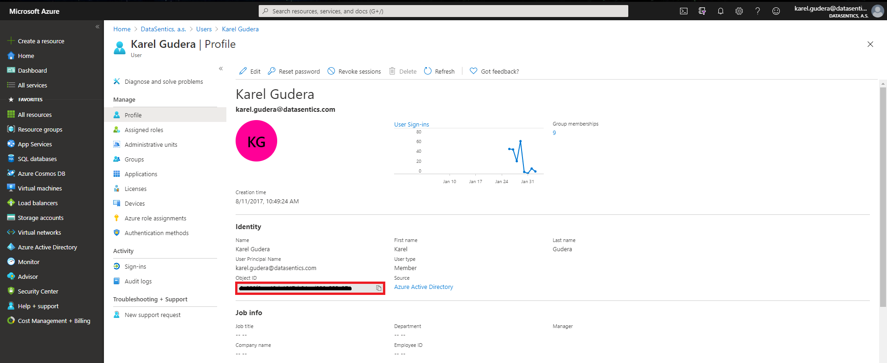

# Spinning up Data Lake resources

[Go to setup steps ↓](datalake-resources-setup.md#1-create-repository-for-infrastructure-and-import-its-code)

{: style="width: 700px; padding-left: 5%"}

## 1. Create repository for infrastructure and import it's code

- In Azure DevOps click on repositories
- Click on dropdown menu
- Click on New repository

- Name it e.g. `infra`
- Uncheck Add a README
- Click Create

- Click on Import
- In Clone URL fill `https://github.com/DataSentics/adap-infra-template.git`
- In Username fill **aisuite@datasentics.com**
- In Password fill the password we have provided you with   
  (In case you don't have the password send a message to **marek.chlubna@datasentics.com**)
- Click on Import

## 2. Set infrastructure variables

The file `.cicd/variables/variables.yml` holds variables that you can use to customize your infrastructure.

Replace the placeholders.

- TENANT_ID - from [Azure setup](azure-setup.md) section 5
- PROJECT_NAME - !! should be simple lowercase name (max 5 characters) !!
- SERVICE_CONNECTION_NAME_DEV - devops-service-connection-to-devsubscription
- SERVICE_CONNECTION_NAME_TEST - devops-service-connection-to-testsubscription
- SERVICE_CONNECTION_NAME_PROD - devops-service-connection-to-prodsubscription
- GIT_ACCOUNT_NAME - name of your devops organization
- GIT_PROJECT_NAME - name of your devops project

In the files `.cicd/variables/variables-{dev/test/prod}.yml` change ADMIN_OBJECT_ID to object id of user of your choice. This user will have admin access to created keyvault.

You can find user object id in Active Directory.

## 3. Create DevOps pipeline for infrastructure build & deployment

- In Azure DevOps click on pipelines
- Click on New pipeline

- Select Azure Repos Git

- Select infra repository

- It will automaticaly locate file `azure-pipelines.yml`
- Click on Run

## 4. Create Key Vault Secret Scope in Databricks

When the pipeline is finished you need to create secret scope for Databricks.

!! This needs to be done for all environments dev/test/prod !!

- Go to Databricks workspace

- Look in the URL
- There should be something like `https://adb-3076017168624144.4.azuredatabricks.net/?o=3076017168624144`
- Add `#secrets/createScope` at the end of URL
- URL now should look like `https://adb-3076017168624144.4.azuredatabricks.net/?o=3076017168624144#secrets/createScope`
- Hit enter and you should be redirected to the page below

- Fill in information
- Scope Name - `unit-kv`
- DNS Name and Resource ID can be found in key vault properties

## 5. Resources overview

After the infrastructure is deployed you can check the resources under resource group `adap-cz-PROJECT_NAME-rg-dev`

**Main components**

- Databricks workspace - this is place where you develop your spark notebooks
- Storage accoount - this is place where your data lives
- Key vault - this is place where secrets are stored
- Data factory - main orchestration engine for your Databricks notebooks
- Virtual network - Key vault and Databricks clusters are deployed in this virtual network for better isolation

