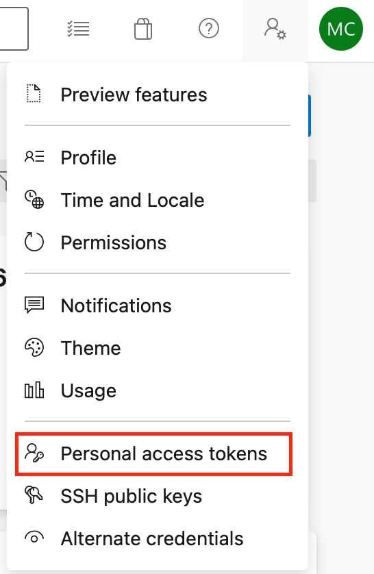
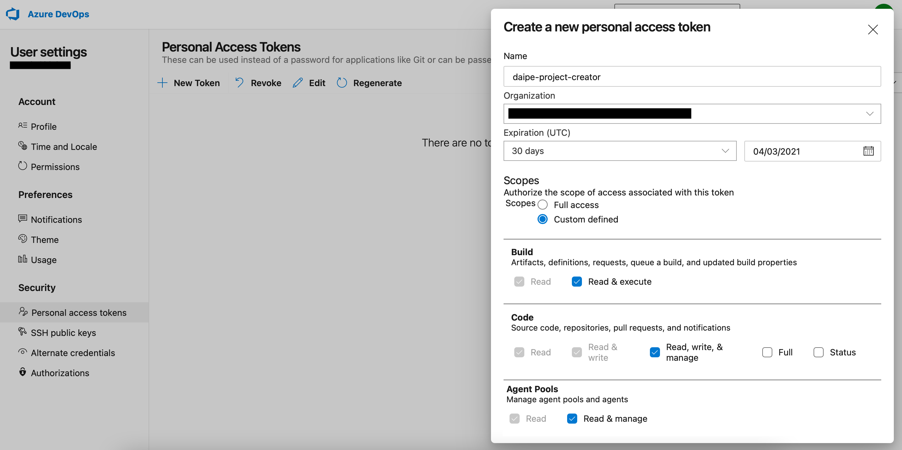
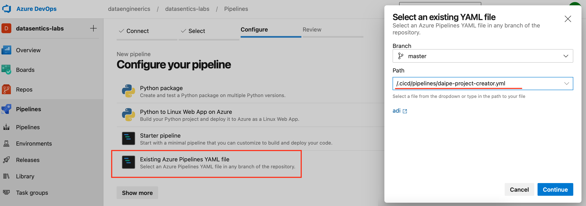
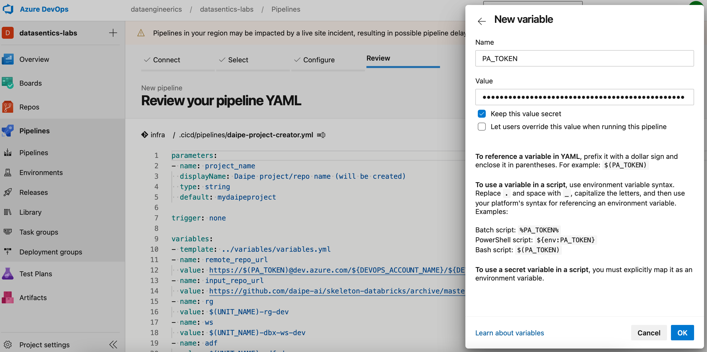
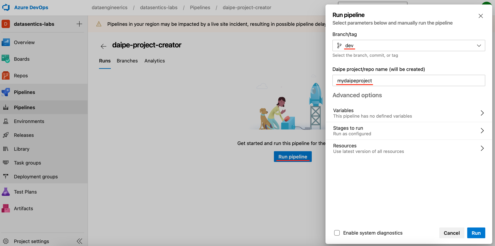
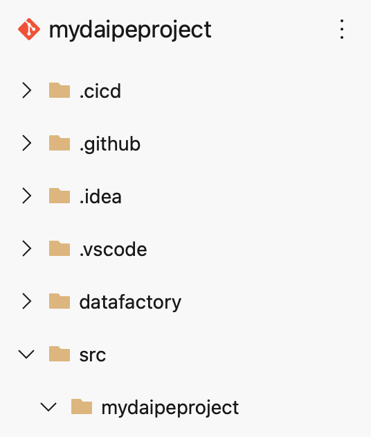
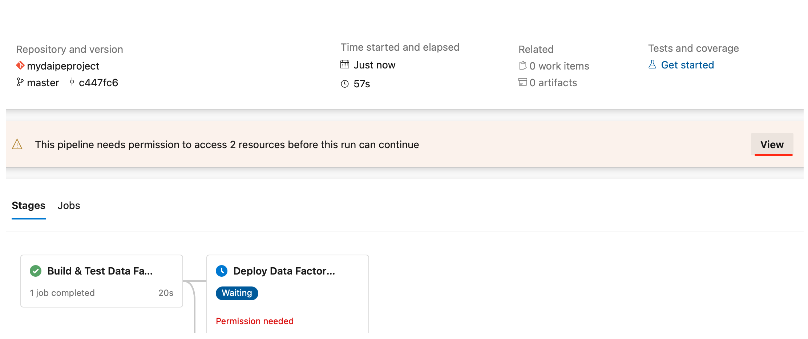
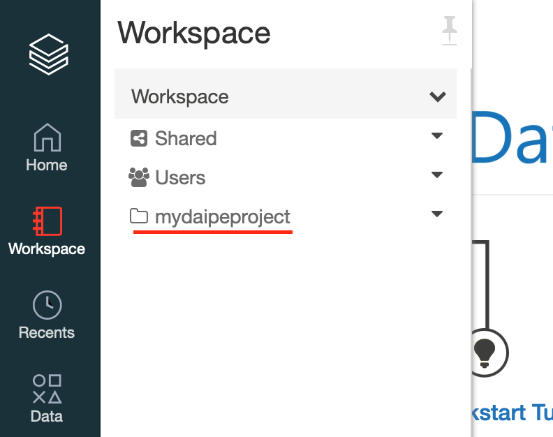

# Creating first Data Lake project

## Introduction and Prerequisites

###**Introduction**
`bricksflow-project-creator.yml` is Azure DevOps pipeline that initiates a new [Bricksflow](https://github.com/bricksflow/bricksflow) project from the up-to-date Bricksflow template.

The pipeline also contains the script for automatic protection of the master branch in newly created project.

####DevOps Bricksflow project consists of the following components: 

A git repo with DataFactory pipelines, Bricksflow project structure and sample notebooks to give you sense about the usage and workflow.

CI/CD pipelines:

- for testing/deployment of your Databricks notebooks / pipelines to the Databricks workspace based on the environment
- for testing/deployment of DataFactory linked to your project

### **Prerequisites**
For initial setup of Bricksflow based project / repository:

- Successfully deployed **Infrastructure** from [Spinning up resources](resources-setup.md) page
- Permission to create Personal Access token in your DevOps organization project
- The pipeline assumes existence of bricksflow-template repo within the same Azure DevOps organization and project as infrastructure reopsitory

## How to set up Bricksflow based project?

### To create a new Bricksflow project you need to:
####1. Create Personal access token for the first run of the pipeline
- The Personal Access token is needed just for the first run of the pipeline to create a new Bricksflow based project DevOps repository and initial set up of the CICD pipeline
- **It can be deleted** after the successful run of the `bricksflow-project-creator.yml` 

**Go to**:

!

Then create the new Personal Token with these permissions.

!

####2. Register the Bricksflow project creator pipeline and run it
**Create** a new DevOps pipeline based on `.cicd/pipelines/create-ml-repo.yaml` located in infrastructure repo

!
!
!

!

Set a **PA_TOKEN** variable under the Variables by providing Personal Access Token and **save** the pipeline. 

!
!

You can now rename the pipeline, if you'd like to.

**Run** the newly created pipeline and provide the **name of the project** you want to create.

!

Pipeline will need the permission to access the service principal for getting the Databricks workspace variables.

Open the run of the pipeline and under the **View** permit the usage of service principal. 

!

## Created resources 

After successful execution, you will find the following **resources**: 

- A new **git repo**
  
  !

  
- **Protected master branch** 
  
    - the initial setup will create the master branch and deploy it to the DEV environment
    - for merging feature branch:
        - the Pull Request needs to be done
        - the notebooks will be deployed to the TEST environment for testing successful run of the pipelines
        - there needs to be in minimum ONE approval for the PR
        - Merging is done by the Squash commit

* **Main CI/CD pipeline** created for the repo. The pipeline is called `master-$yourprojectname-deployment`. 
  
  !

**Note**: the pipeline will be executed automatically after creation of the Bricksflow project repository for deploying sample notebooks to Databricks and will ask for permission to the service connection, as it is shown on the picture below.

!

## Next steps 

After an initial run of the pipelines, you will have **codes** available in the **Databricks workspace** corresponding to the Databricks environment.

!

You can find the links to the corresponding Databricks workspace directly in the CICD pipeline in the Deploy .

!

Also the **DataFactory** in the specific environment **will be linked** to the codes in the Databricks workspace.

You can find the links to the corresponding Databricks workspace directly in the CICD pipeline. 

!

