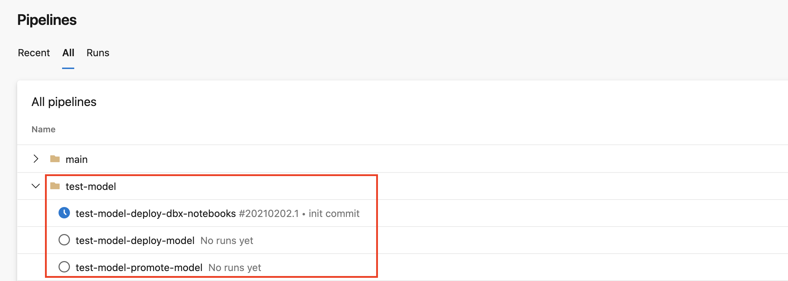
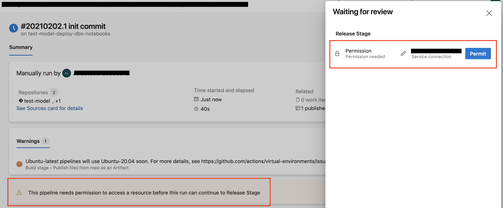

# Creating first Machine Learning project 

The page explains how to configure and utilize an ML project creator defined by an Azure DevOps pipeline. 

## Prerequisites 

* The ML-project creator pipeline assumes existence of infrastructure and the infrastructure repo created with ADI toolkit (see ["Spinning up resources"](datalake-resources-setup.md) page)
* The repo assumes existence of [ml-project-template](https://dev.azure.com/dataengineerics/datasentics-labs/_git/ml-project-template) repo within the same Azure DevOps organization and project as infrastructure

## 1. Configure DevOps pipeline

To create an ML repo we first need to configure a DevOps pipeline. To do so, 

1. Create a DevOps pipeline based on `create-ml-repo.yaml` located in infrastructure repo
1. Add Azure DevOps Personal Access Token (PAT) and user name as pipeline variables under the *Edit* tab of the pipeline as it is shown on the picture below. The PAT will be used to access Azure DevOps services such as git and DevOps pipelines.
    * `GIT_ACCESS_TOKEN` - PAT with permissions enough to create and read git repos and DevOps pipelines within the DevOps organization
    * `GIT_USERNAME` - name of a user for which the token was generated

## 2. Create a new ML training application

To create a new ML training application

1. Make sure your DevOps project was configured as described above 
1. In the DevOps space corresponding to your project, under *Pipelines* tab, find `ml-project-creator-pipeline`
1. Run the pipeline providing the following arguments:
    * Git repo name `<repo_name>` - the name of the git repo for your ML training application, which will be created by the pipeline. Note that the model developed within will be named the same way.
    * Development environment name `<env_name>` - name of the environment you plan to develop your project in (should correspond to an existing environment)
    * Run with demo project - if "Yes", you will have an example of training application within the created project

### Created resources 

After successful execution, you will find the following resource

* A new `<repo_name>` git repo
* Several CI/CD pipelines created for the repo. Each pipeline is named `<repo_name>-<pipeline_name>` and is located under <repo_name> pipeline folder.  In particular, you will find
    * **CI/CD pipeline** for **codes**, triggered by an update in `src/` folder (any branch). The pipeline deploys codes from the git repo to databricks workspace.
    * **CI** for **models**, which is triggered by a merge to master branch. The pipeline tests and promotes a model (which is in "Staging" state) to the "Production" state.
    * **CD** for **models**, which is triggered manually. The pipeline deploys a model to the specified could service (e.g., ACI)

**Note 1**: the CI/CD pipelines for codes deployment will be executed automatically after the creation 

**Note 2**: during the first execution, echo pipeline will ask for permission to the service connection, as it is shown on the pic below.

### What's next

After an initial run of the pipelines, you will have codes available in the databricks workspace corresponding to the `<env_name>` development environment. 

MLOps pipelines will support the model lifecycle and will be triggered as described above.

### Further reading

See the created project README for further details.
