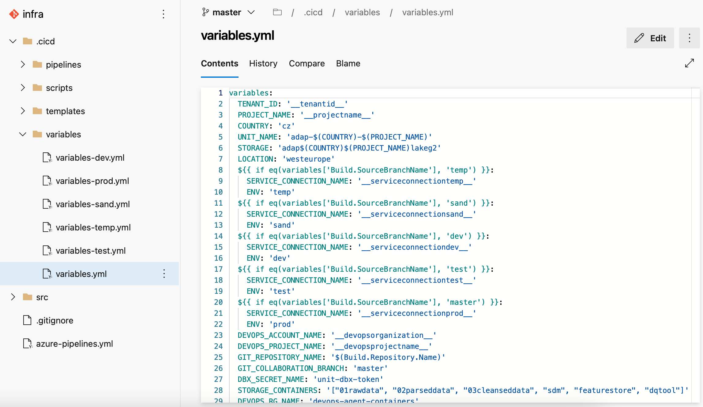

# Spinning up resources

## 1. Create repository for infrastructure and import it's code

- In Azure DevOps click on repositories
- Click on dropdown menu
- Click on New repository

- Name it e.g. `infra`
- Uncheck Add a README
- Click Create

- Click on Import
- In Clone URL fill `https://github.com/DataSentics/adap-infra-template.git`
- Click on Import

## 2. Set infrastructure variables

The file `.cicd/variables/variables.yml` holds variables that you can use to customize your infrastructure.

Replace the placeholders.

- TENANT_ID - from previous steps
- PROJECT_NAME - to your liking
- SERVICE_CONNECTION_NAME_DEV - devops-service-connection-to-{devsubscription}
- SERVICE_CONNECTION_NAME_TEST - devops-service-connection-to-{testsubscription}
- SERVICE_CONNECTION_NAME_PROD - devops-service-connection-to-{prodsubscription}
- GIT_ACCOUNT_NAME - name of your devops organization
- GIT_PROJECT_NAME - name of your devops project

## 3. Create DevOps pipeline for infrastructure build & deployment

- In Azure DevOps click on pipelines
- Click on New pipeline

- Select Azure Repos Git

- Select infra repository

- It will automaticaly locate file `azure-pipelines.yml`
- Click Save

- Go back to Azure pipelines
- Click on All
- Click on infra

- Click on Run pipeline

