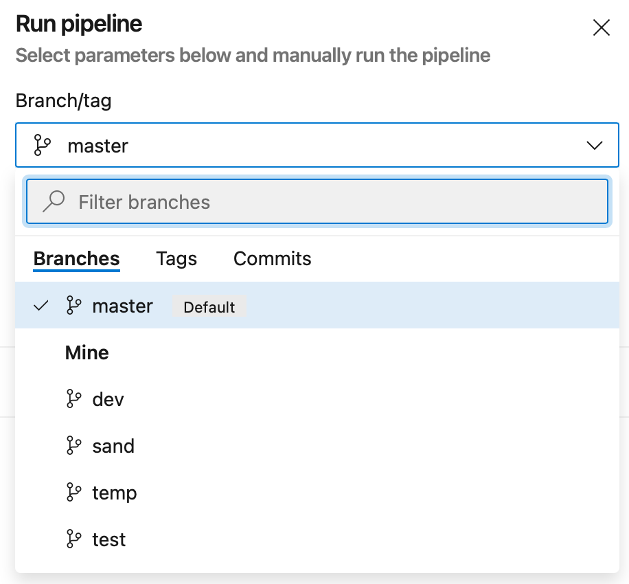

# Spinning up resources

## 1. Create repository for infrastructure and import it's code

- In Azure DevOps click on repositories
- Click on dropdown menu
- Click on New repository

!

- Name it e.g. `infra`
- Uncheck Add a README
- Click Create

!

- Click on Import
- In Clone URL fill `https://github.com/DataSentics/adap-infra-template.git`
- In Username fill your Datasentics email
- In Password fill your Github password
- Click on Import

!

## 2. Set infrastructure variables

The file `.cicd/variables/variables.yml` holds variables that you can use to customize your infrastructure.

!

Replace the placeholders.

- TENANT_ID - from previous steps
- PROJECT_NAME - should be simple lowercase name (max 5 characters!)
- SERVICE_CONNECTION_NAME_DEV - devops-service-connection-to-{devsubscription}
- SERVICE_CONNECTION_NAME_TEST - devops-service-connection-to-{testsubscription}
- SERVICE_CONNECTION_NAME_PROD - devops-service-connection-to-{prodsubscription}
- GIT_ACCOUNT_NAME - name of your devops organization
- GIT_PROJECT_NAME - name of your devops project

In the files `.cicd/variables/variables-{dev/test/prod}.yml` change ADMIN_OBJECT_ID to object id of user you want to have access to keyvault.

You can find user object id in Active Directory.

!

## 3. Create DevOps pipeline for infrastructure build & deployment

- In Azure DevOps click on pipelines
- Click on New pipeline

!

- Select Azure Repos Git

!

- Select infra repository

!

- It will automaticaly locate file `azure-pipelines.yml`
- Click Save

!

- Go back to Azure pipelines
- Click on All
- Click on infra

!

- Click on Run pipeline

!

- You can select which stages you want to run

!
!

- Click Run

!
