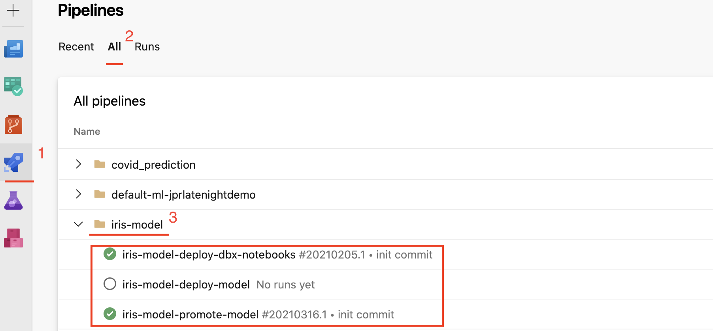

# MLOps pipelines 

MLops pipelines are part of the ML application repo. You can find them under `mlops/pipelines`.

When executed, ML project creator creates corresponding DevOps pipelines automatically. Those DevOps pipelines could be found under the `Pipelines` section in the DevOps project under the folder identical to the project name, as it is shown on the picture below for `iris-model` repo. 

{: style="width: 750px; padding-left: 5%"}

## Code CI/CD

The pipeline is defined by `dbx-notebooks-cicd.yml` and is aimed at deploying application code to a Databricks workspace.

The pipeline is triggered by merge of change for files located in `/src` folder. 
When triggered, the pipeline deploys codes into the development environment (provided by a user when creating the ML application repo). In the corresponding Databricks workspace, the code will be located under `ml_apps/{ml_app_name}/{branch_name}`.

**Note that**

* The pipeline deploys code from a remote git repo into a Databricks workspace. It does not synchronize the changes back from the Databricks into the git repo.

## Model CI

The pipeline is defined by `promote-model-cicd.yml` and is aimed at testing and promoting a model to production stage. The pipeline is triggered automaticaly when there are changes in `master` branch of the repo. 

In the workflow, we assume the following notation:

* An ML application repo is used for training codes for a single ML model 
* Model name corresponds to the ML application repo name 
* Model stage is used to distinct if model is still in development (`None` stage) if is ready to be promoted (`Staging` stage), or if it is ready to be used in production (`Production` stage). 

Models are moved to `Staging` stage by user, when the model is ready to be tested and promoted by the Model CI DevOps pipeline. 

The pipeline performs the following steps: 

* It fetches model with the corresponding to the git repo name and which is in the stage `Staging`
* It runs tests for the model by executing `./src/model/tests/test_model.py` script and generates a report in `xml` format
* It tags the model with git commit id, branch name, test status, and the pipeline run URL 
* In case test run successfully, it promotes model to stage `Production`
* Finaly, it sends a notification to Slack to a service specified in the pipeline `yaml`

**Note that**

* Models are moved to `Production` stage only by the Model CI DevOps pipeline. It could not be moved manually by a user.
* Multiple models with the same name could be in `Production` stage simultaneously 

## Model CD

The pipeline is defined by `deploy-model.yml` and is aimed at deploying the model of a specified version to the specified cloud service. 

The pipeline is triggered manually. The pipeline asks for service specification, such as CPU, memory requirements, and for compute type. Currently, only Azure Container Instances (ACI) compute type is implemented.

**Note that**

* Model in any stage could be deployed
* Each model will be deployed to its own instance 
* The service will exist within the development resource group
* After deployment, the model will be tagged with scoring URI