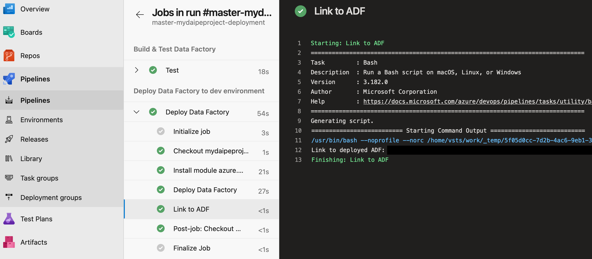
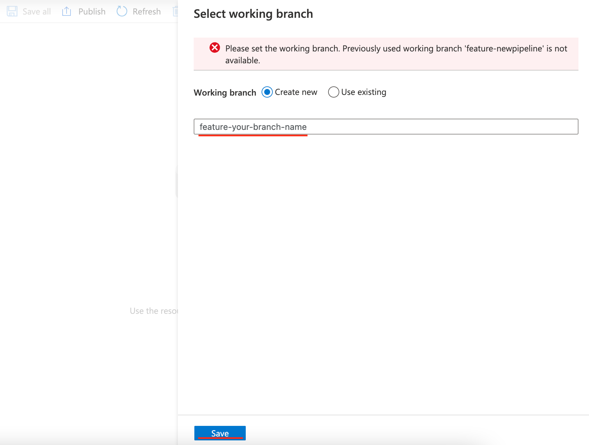

# Setting up a DataFactory pipeline

Go to the Data Factory associated with your project.

- You can find it under the Dev Resource Group 
- Or you can open the link to the instance in DevOps Pipelines - Deploy Data Factory to dev environment (see picture below).

In Data Factory go to the Author section.

{: style="width: 700px; padding-left: 5%"}

**Create or Select existing branch:**

- If you are creating pipeline for the notebooks in the master branch select **Create new** and name it
- If you want to create pipeline based on the notebooks from the commited feature branch select **Use existing** and select the branch

{: style="width: 600px; padding-left: 5%"}

On top you can see that you are using your branch.

You can create a new pipeline or update the existing one by selecting it under the Pipelines. 

We are going to update the existing one `CovidPipeline` for our demo purpose. 

When you're done with editing the pipeline:

- Debug it
- After successful run hit Save (or Save All for multiple pipelines)

The new commit in DevOps repository under your branch used in Data Factory will be created. 

