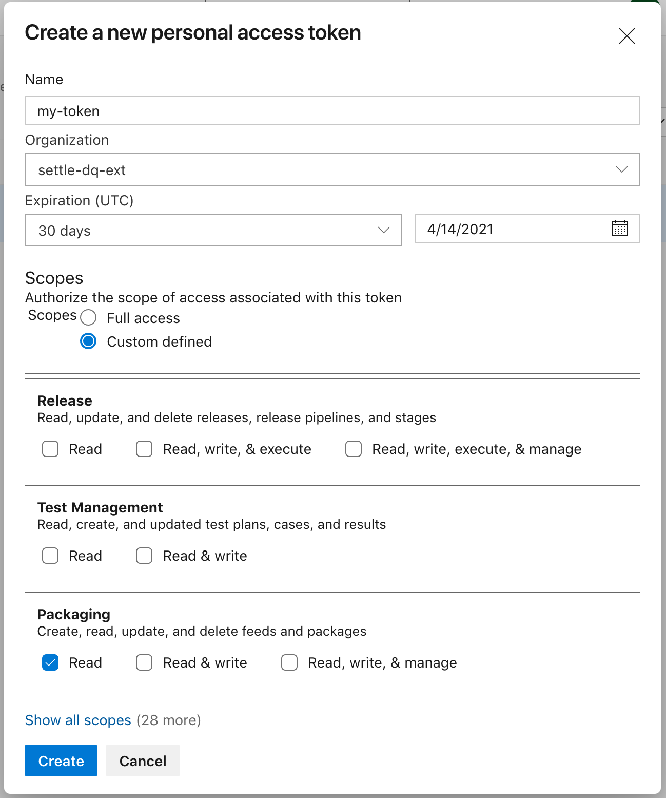
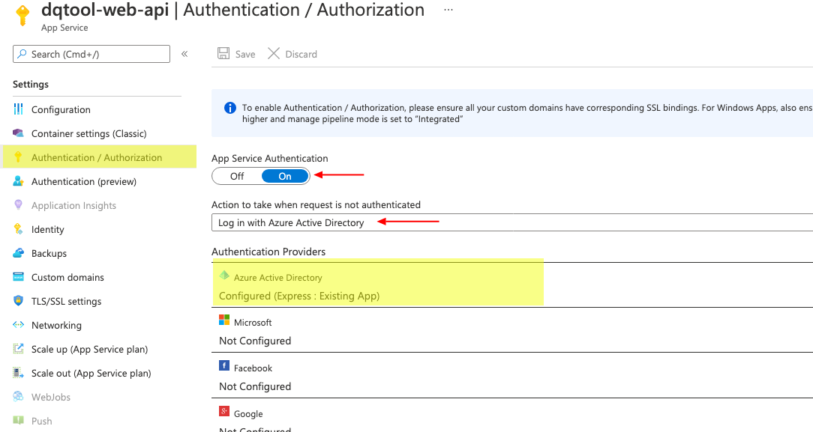

# Azure Setup

{: style="width: 750px; padding-left: 5%"}

The schema above shows the infrastructure the system operates on. You will need to set up the resources displayed in the *Your Azure Cloud* rectangle.

We recommend creating the resources in the order described in this guide.

## Prerequisites
You will need the following prerequisites to start following this guide.

### Guest user in DataSentics Azure Cloud
You will install Settle DQ code from artifacts that are distributed using DataSentics Azure cloud. DataSentics will invite you as a guest user. For that you will need an email address that can receive emails. We recommend using a technical user, not a real person's email.

The access to our Azure will be used for downloading and installing artifacts as a part of the initial setup as well as upgrading to future Settle DQ versions. 

Follow these steps to create a guest user account:

- Locate an invitation email in your inbox from *invites@microsoft.com*
- Click an *Accept Invitation* link in the email
- If this email address doesn't have a Microsoft account yet, it needs to sign up for one. Follow the instructions. You will get another email with a verification link or code.
- You will be promted to accept permissions for DataSentics to Sign in and Read email address. Click accept. 
- You will get yet another email that welcomes you to Azure Devops

Now you will be able to login with this guest account to Subscriber resources in DataSentics Azure cloud. Verify you can log in. 

### Artifact Feed URLs from DataSentics
DataSentics will give you the following URLs. You'll use them to download artifacts described in the guide.

- Python Artifact Feed URL, format `https://dev.azure.com/xxx/_packaging?_a=feed&feed=dq_tool%40Local`
- private PyPI URL, format `pkgs.dev.azure.com/xxx/_packaging/dq_tool%40Local/pypi/simple/`
- Universal Packages Artifact Feed URL, format `https://dev.azure.com/xxx/_packaging?_a=feed&feed=web_files_zip`

### Web App: Container Registry Credentials from DataSentics
For deploying the web app, you will need credentials to Azure Container Registry. From there you will pull a docker image to run in your Azure Web App. 

You will need:

- Server URL
- Username
- Password
- Image and tag

### Azure CLI installed
Follow the [installation instructions](https://docs.microsoft.com/en-us/cli/azure/install-azure-cli)

Add the DevOps extension:
```
az extension add --name azure-devops
```

### Permissions


You will need a subscription in your Azure Cloud where you have permissions to the following Resource providers. The ones that are **bold** are explicitly needed for the system to be set up and work properly.  

- **Microsoft.Databricks**
- Microsoft.DataFactory
- Microsoft.OperationalInsights
- **Microsoft.KeyVault**
- **Microsoft.Storage**
- Microsoft.Network
- **Microsoft.ManagedIdentity**
- Microsoft.Security
- **Microsoft.PolicyInsights**
- Microsoft.GuestConfiguration
- Microsoft.Compute
- **Microsoft.ContainerService**
- Microsoft.Advisor
- microsoft.insights
- Microsoft.MachineLearningServices
- Microsoft.Purview
- **Microsoft.DBforPostgreSQL**
- **Microsoft.Web**

## 1. Resource Group
We recommend [creating a new resource group](https://docs.microsoft.com/en-us/azure/azure-resource-manager/management/manage-resource-groups-portal#create-resource-groups) for all resources that you will create for Settle DQ. 

## 2. Key Vault
You will need an Azure Key Vault to store database connection parameters. If you already have a Key Vault, you can use it. If not [create one](https://docs.microsoft.com/en-us/azure/key-vault/general/quick-create-portal) in your Resource Group. 

## 3. Database
The database is the center piece of the DQ Tool. The Python API stores expectation definitions and validations results there. The Web App reads information to display from there. 

If you already have an Azure PostgreSQL Database server, you can just create a new database there. Connect to the server and [create a new database](https://www.postgresql.org/docs/10/sql-createdatabase.html).

If you don't have a database server, you'll need to create one. We recommend using Azure Database for PostgreSQL. Follow the [quickstart guide](https://docs.microsoft.com/en-us/azure/postgresql/quickstart-create-server-database-portal). We recommend the following options:

- Single server
- PosgreSQL 10
- Choose the machine depending on your expected workload, the minimal recommended requirements are 1 vcore, 20GB storage

For later steps you will need the following parameters. [Store them to your Key Vault](https://docs.microsoft.com/en-us/azure/key-vault/secrets/quick-create-portal).

- host
- port
- database
- username
- password


## 4. Databricks
If you're not using Azure Databricks yet, you'll need to [create a new Databricks Workspace](https://docs.microsoft.com/en-us/azure/databricks/scenarios/quickstart-create-databricks-workspace-portal?tabs=azure-portal). 

If you're already using Azure Databricks and have a workspace, you can just use that. 

You will need an interactive cluster with Databricks Runtime >= 7.0 to install the wheel to. 

Your Databricks will need access to Azure Key Vault to retrieve the database credentials. Follow [the guide to create an Azure Key Vault-backed secret scope](https://docs.microsoft.com/en-us/azure/databricks/security/secrets/secret-scopes#akv-ss). Call it `dbx_scope`. 

Now we'll install `dq_tool` python wheel to Databricks. The wheel provides a python interface that *Data Engineers* use to [develop and manage data expectations](../developing-expectations/index.md). There are two options how to install the wheel.

### Option A: Manual Wheel Installation
We only recommend using this option when your Databricks workspace doesn't have access to internet. The downside is that you will need to manually download and update the wheel with every new version.

- Download a wheel from the Pytho Artifact Feed URL you got as a prerequisity
- Upload the wheel to your Databricks workspace and install the wheel to the given [cluster](https://docs.databricks.com/libraries/cluster-libraries.html) or [notebook](https://docs.databricks.com/libraries/notebooks-python-libraries.html).

### Option B: Installation from private PyPI
This is an automated way to install the `dq_tool` package. You don't need to store the wheel anywhere, it will always be installed from DataSentics private PyPI that is a part of an Azure DevOps Artifact Feed.

First you need to [generate a Personal Access Token (PAT)](https://docs.microsoft.com/en-us/azure/devops/organizations/accounts/use-personal-access-tokens-to-authenticate?view=azure-devops&tabs=preview-page#create-a-pat) for your guest user. In the *Create a new personal access token* dialog you need to provide the following:

- *Organization*: settle-dq-ext. If you can't see settle-dq-ext, choose *All accessible organizations*
- *Scopes: Custom defined*
- In *Packaging* section check *Read*
- *Name* and *Expiration* are up to you

{: style="width: 750px; padding-left: 5%"}

Save the token and [add it to your Key Vault](https://docs.microsoft.com/en-us/azure/key-vault/secrets/quick-create-portal) as `ds_azure_pat` along with the technical user email address `ds_azure_email` and DataSentics PyPI URL `ds_pypi_url` you got as a prerequisity.

In your notebook, install the library using something like

```python
user = dbutils.secrets.get(scope="dbx_scope", key="ds_azure_email")
token = dbutils.secrets.get(scope="dbx_scope", key="ds_azure_pat")
pypi_url = dbutils.secrets.get(scope="dbx_scope", key="ds_pypi_url")

%pip install dq_tool --extra-index-url=https://$user:$token@$pypi_url
```

If you get an error like the one below, it means you don't have permissions for the feed, or your PAT is wrong.

```
WARNING: 401 Error, Credentials not correct for https://pkgs.dev.azure.com/xxx/_packaging/dq_tool%40Local/pypi/simple/dq_tool/
  ERROR: Could not find a version that satisfies the requirement dq_tool (from versions: none)
ERROR: No matching distribution found for dq_tool
```

### Verify The Installation
Run the following code to verify you can connect to the database. 
```python
from dq_tool import DQTool
dq_tool = DQTool(
    spark=spark,
    db_store_connection={
        'drivername': 'postgresql',
        'host': dbutils.secrets.get(scope='dbx_scope', key='host'),
        'port': dbutils.secrets.get(scope='dbx_scope', key='port'),
        'database': dbutils.secrets.get(scope='dbx_scope', key='database'),
        'username': dbutils.secrets.get(scope='dbx_scope', key='username'),
        'password': dbutils.secrets.get(scope='dbx_scope', key='password')
    }
)
```

The code creates the database schema if it's not there yet. Then you can start using the python interface as described in the [Develop Expectations guide](../developing-expectations/index.md). Save the code, you'll use it in the [Configuration Notebook](./configuration-notebook.md)

## 5. Web Application
The *Data User* checks the validation results in a web application. It needs an Azure Web app and a Storage account.
add Web App

### Create Web App
Create a [Web App in the Azure portal](https://portal.azure.com/#create/Microsoft.WebSite). Use the following options:

- Select your *Subscription* and *Resource Group*
- *WebApp name*: your choice
- *Publish*: select *Docker Conatiner*
- *Operating system*: *Linux*
- *Service Plan*: Create new
- *SKU size*: select *B1* at least

Click *Next : Docker >*

Now you'll need to fill in the credentials for a private Docker registry, you got from DataSentics.

- *Options*: *Single Container*
- *Image Source*: *Private Registry*

{: style="width: 750px; padding-left: 5%"}

Click *Review + create*

### Create Storage Account
Create a [Storage Account in the Azure portal](https://portal.azure.com/#create/Microsoft.StorageAccount). Use the following options:

- *Storage account name*: Use 5-50 just alfanumeric characters
- *Performance*: *Standard*
- *Account kind*: *StorageV2 (general purpose v2)*
- *Replication*: *RA-GRS*

Click *Review + create*

Now open your newly created Storage Account. On the left side in *Settings* click *Static Website*. Use the following options:
- *Static website*: click to set *Enabled*
- *Index document name*: *index.html*

Click *Save*


### Upload Frontend Files to Storage Account
Now you need to download the web frontend static files zip archive. Open the link you got as desribed in Prerequisites. Download the zip directly from the website, or click *Connect to feed* to download using the CLI. 

Unzip the archive. Use the `az` CLI to upload the contets to the Storage account:
```
az storage blob upload-batch -d '$web' -s ./build --account-name <name of storage>
```

### Set Web App Environment Variables
You need to point the web app to the database and to the Storage account with the frontend files.

Open your Web App, on the left side under *Settings* click *Configuration*. Add the following env variables:

- DB_HOST
- DB_PORT
- DB_NAME
- DB_USER
- DB_PASS
- FE_CONTAINER_ADDRESS: URL of the Storage, format `https://xxx.web.core.windows.net/`

{: style="width: 750px; padding-left: 5%"}

### Add authentication to the web app
The easiest option to enable authentication is the *Express* option. To enable authentication using the Express option, follow these steps:

1. In the [Azure portal](https://portal.azure.com/), search for and select *App Services*, and then select your app.
2. From the left navigation, select *Authentication / Authorization* > *On*.
3. Select *Azure Active Directory* > *Express*.
  - If you want to choose an existing app registration instead:
    1. Choose *Select Existing AD app*, then click *Azure AD App*.
    2. Choose an existing app registration and click *OK*.
4. Select *OK* to register the App Service app in Azure Active Directory. A new app registration is created.

{: style="width: 750px; padding-left: 5%"}

Click *Save*

## Congratulations
You can find the URL of the web app in the Web App Overview, usually in format `https://xxx.azurewebsites.net`

Now you can continue with [Developing Expectations Guide](../developing-expectations/index.md) to start using Settle DQ. 
